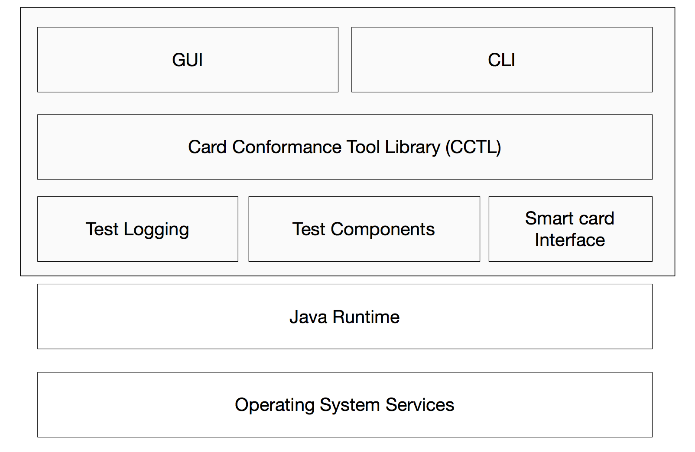

# High Level Design #

## Introduction ##

The purpose of the Card Conformance tool is to validate that commercially available PIV and PIV-interoperable smart cards comply with current relevant standards. The Card Conformance tool should be able to safely test a variety of cards on a variety of platforms.

### Platform Support ###

The CCT runs on the following platforms when an appropriate JRE (8.0 or later) and PC/SC manager is installed:

- Mac OS X 10.11 or later
- Windows 10 or later
- Red Hat Enterprise Linux 6 or later
- Ubuntu LTS release 16.04 or later

The CCT can be modified and compiled on any platform where JDK 8.0 or later is installed. Note that some dependencies used by the CCT will require an appropriate C++ compiler if native code is to be changed; pre-built native components will be made availabe for the platforms listed above.

### Test Notes ###

While the CCT is intended to be read-only with respect to the cards under test (and therefore will not perform operations such as personalization or key generation) certain "read" operations that will be tested by CCT require authentication. Authentication failures can cause the card to alter its state in an unrecoverable way.

## Overview ##

The Card Conformance tool has three principle modes of operation:

- Test Configuration
- Test Execution
- Report Generation

While the tool will offer both a graphical and a command line user-interface, not all operations will be available from the command-line interface. In particular, some test configuration operations may either require the use of the GUI or manual edits to a configuration file. The purpose of the command line interface is to allow "headless" execution of pre-configured sets of tests.



Both interfaces will share a common library for loading, configuring and executing tests. This library will depend on several subcomponents along with the facilities provided by the JRE and the OS. Where possible, the subcomponents will reuse publicly available open source libraries.

## External Interfaces ##

### GUI ###

The CCT GUI will resemble an Integrated Development Environment used for software development. It will provide functions for creating and editing "Card Conformance Test Set" (CCTS) documents. These documents will contain the following:

- Test selections
- Test configurations
- Test run history with results
- Reports generated

The GUI will allow the user to:

- Alter the selected set of tests
- Edit configurable parameters for the tests
- View the test run history
- Clear the test run history
- View test reports
- Export test reports
- View test logs
	- Filter test logs
- Export test logs
	- Including filtered views of logs
- Configure logging settings for both GUI tool operation and test execution
- Execute tests with a progress display

### Command Line ###

The CCT command line will execute tests in an existing CCTS document, as configured by the CCT GUI. It will allow logging settings to be configured using textual properties files (which may be prepared in the GUI) and will store the results of the test runs either in the CCTS document it runs from or in a copy of the CCTS document, as determined by arguments supplied on the command line.

It will also offer the ability to export test reports from test runs within a CCTS document.

### CCTS Document ###

CCTS documents will be sqlite 3 databases. These are intended to be manipulated using the GUI and command line interfaces, but a schema for these databases will be included with the end-user documentation to facilitate manipulation using standard commercially available sqlite tooling.

## Internal Interfaces ##

This section describes the decomposition of the CCT into components and characterizes the interfaces between them. Some of the details here belong in lower level documents and will be replaced with references once these are in place.

## Card Conformance Tool Library ##

CCT will have two front-ends, as discussed above. Both of these will exercise functionality exposed in the Card Conformance Tool Library (CCTL). The CCTL will expose the following classes of interface:

- Test Case Manipulation - instantiate and configure `TestCase` objects
- Test Case Execution - set up, execute and tear down one or a series of `TestCase` objects, returning a `TestResult` object
- Test Case Serialization - write a `TestCase` object to a CCTS document
- Test Result Serialization - write a `TestResult` object to a CCTS document
- Report Generation

### TestCase Interface ###

```java
interface TestCase {
	Map<K,V> getDefaultParameters();
	TestResult run(Map<K,V> parameters);
	void setup(Map<K,V> parameters);
	void tearDown(Map<K,V> parameters);
	String getIdentifier();
	String getDescription();
	boolean getExpectedResult();
}
```

Specific test case classes will implement this interface. To manipulate parameters, the GUI will instantiate the test case class, call `getDefaultParameters()`, and show a UI to edit any configurable values returned.

To serialize a test case, the GUI will supply the edited map of parameters back to the CCTL along with the class name, and the CCTL will write this to the sqlite database.

To execute a test case, either the GUI or the command line test runner will use a utility function within the CCTL to deserialize the test case and instantiate it. Then it will call `setup()`, `run()` and `teardown()` in that order before serializing the returned `TestResult` to the database.

### TestResult Interface ###

```java
interface TestResult {
	boolean getResult();
	String getMessage();
}
```

Test execution will result in a TestResult object that can be serialized back to the database. This will include a boolean result and a human-readable message that may provide additional information about the test. The test runner (GUI or command line) will store this in the database with a reference back to the `TestCase` instance that produced it using a utility function exposed in the CCTL. Groups of test results will be stored to correspond to a test run.

### Report Generation ###

The CCTL will expose a utility function that can generate an HTML report for one or more test runs based on results stored by the runner.

### Log Configuration ###

It is anticipated that most test cases will log information at different levels during setup, execution and teardown. The CCTL will provide an interface for either the GUI or the command line runner to configure the verbosity and disposition of these log events using an slf4j configuration file. By using slf4j rather than using log4j directly, specific details of log disposition can more easily differ between the GUI and the command line front-ends.

## Subcomponents ##

While the CCTL will provide the interfaces used by the two front-ends, most of the implementation of these interfaces will be delegated to subcomponents. This will serve to ease implementation of a more diverse set of test cases as well as to allow reuse of the smart card interface in other test tools.

### Test Logging Library ###

The test logging library will set up categories and log levels as well as provide logging functions for data types commonly logged by test cases in the CCTL. It will augment the slf4j rather than hide its interface; once the test logging library is used to set up appropriate facilities test cases may use slf4j interfaces directly for logging where that makes sense.

### Test Component Library ###

The test component library will encompass two functions that may later appropriately be split into separate libraries but currently are tightly enough coupled that it makes more sense to keep them in the same library:

- Concrete test case implementations
- Test "step" implementations

A test case consists of one or more steps. While each test case is unique, many steps are reused across test cases.

### Smartcard Interface Library ###

The smartcard interface library will expose an interface that is very similar to that documented in SP800-73, although it will not be a complete implementation of that specification and will make allowances for more idiomatic java practices where those are beneficial.

Implementation of the smartcard interface will use `javax.smartcardio` where feasible, only resorting to platform-specific native libraries if absolutely necessary

## Third-party Components ##

The following third-party libraries are used in CCT:
- Eclipse Rich Client Platform
	- Runtime
	- SWT
	- JFace
	- Workbench
- JUnit
- Apache Commons Libraries:
	- CLI
	- Codec
	- I/O
- Simple Logging Facade for Java (slf4j)
- Bouncy Castle for Java
- Oracle javax.smartcardio

## Source Tree Layout ##

CCT will follow the maven conventions for directory layout

| Directory | Purpose |
| --------- | ------- |
| `src/main/java` | application or library sources |
| `src/main/resources` | resources used at runtime for application/library |
| `src/test/java` | test sources |
| `src/test/resources` | resources used at test time |

Following this convention will facilitate reuse of existing build infrastructure.